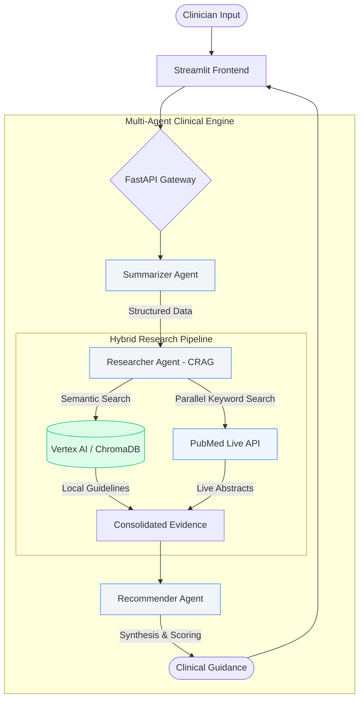

# ⚕️ Clinical Decision Support System (CDSS)

## 📌 Problem Statement
Clinicians today face a dual challenge: **increasingly complex patient data** and an **exponential growth in medical literature**. Research shows that diagnostic errors contribute to approximately 10% of patient deaths, often due to the inability to synthesize vast amounts of clinical guidelines and live research in real-time during a patient encounter.

## 💡 Our Solution
The **Clinical Decision Support System (CDSS)** is a production-grade, multi-agent AI framework designed to bridge this gap. By automating the extraction of key findings from unstructured reports and performing high-speed, parallel retrieval of established protocols (e.g., GINA, USPSTF) and live peer-reviewed research (PubMed), the app provides:
*   **Reduced Cognitive Load:** Agents handle the heavy lifting of information retrieval.
*   **Evidence-Based Accuracy:** Every recommendation is grounded in verifiable clinical sources.
*   **Rapid Decision Support:** Optimized for low latency, providing guidance in seconds, not minutes.

---

## 🔄 System Process Flow



---

## 🚀 Key Features (Production Ready)

*   **Multi-Agent Workflow:**
    *   **Summarizer Agent:** Atomic lazy-loading service for structured clinical extraction.
    *   **Researcher Agent (CRAG):** Hybrid retrieval combining local **Semantic Search** (Vector DB) and remote **Keyword Search** (PubMed).
    *   **Recommender Agent:** Logic-driven clinical synthesis with guideline adherence scoring.
*   **High-Performance Architecture:**
    *   **Async Parallel Research:** Cuts retrieval time by 50% using `asyncio` and `httpx`.
    *   **Atomic Lazy Loading:** Bypasses Cloud Run startup timeouts by loading AI models only on-demand.
*   **Enterprise Reliability:**
    *   **Circuit Breakers:** Uses `tenacity` for resilient communication with external APIs.
    *   **Mission-Critical Fail-Safes:** Graceful fallback to local guidelines if external networks are unavailable.
*   **Security & Compliance:**
    *   **Protected API:** Whitespace-insensitive API Key authentication middleware.

---

## 🛠️ Tech Stack

- **Backend:** FastAPI (Python 3.12)
- **Frontend:** Streamlit (Custom Medical Blue Theme)
- **AI/ML:** Sentence-Transformers, Google Vertex AI Search
- **Database:** ChromaDB (Local Persistence)
- **APIs:** live PubMed (NCBI) Integration
- **DevOps:** uv, Docker, Google Cloud Build

---

## 💻 Local Setup

1.  **Clone & Install:**
    ```powershell
    git clone https://github.com/vinod1rai249-max/clinical-decision-support-system.git
    cd clinical-decision-support-system
    uv sync
    ```

2.  **Run System:**
    ```powershell
    # Terminal 1: Backend
    $env:PORT=8002; uv run python api.py
    
    # Terminal 2: Frontend
    $env:API_BASE="http://localhost:8002/api"; uv run python -m streamlit run app.py
    ```

---

## ☁️ Cloud Deployment (GCP)

Detailed deployment steps are provided in **`DEPLOYMENT.md`**.

---

## 📁 Project Structure

```text
├── api.py                 # Protected FastAPI Entrypoint
├── app.py                 # Premium Streamlit UI
├── services/
│   ├── summarizer/        # Clinical extraction
│   ├── researcher/        # Parallel CRAG Engine
│   └── recommender/       # Protocol synthesis
├── shared/
│   └── shared/
│       ├── pubmed.py      # Async PubMed + Circuit Breakers
│       └── rag.py         # Singleton Vector DB
└── pyproject.toml         # Production dependency config
```

---
**Disclaimer:** This tool is for educational and clinical support simulation only. Always follow established institutional protocols and professional medical judgment.
